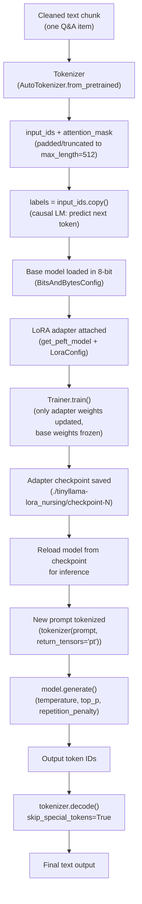

# Fine-Tuning TinyLlama on Pharma/Nursing Pharmacology Data (FineTuning(1).ipynb)


This project fine-tunes **TinyLlama-1.1B** on domain-specific text extracted from a pharmacology/nursing PDF, using **LoRA (Low-Rank Adaptation)** with 8-bit quantization for memory-efficient training on a single GPU (Google Colab, free tier).

## Overview

The notebook walks through the full pipeline: extracting and cleaning text from a PDF, converting it into a Hugging Face `Dataset`, tokenizing it, and fine-tuning a causal language model on it — first attempting full fine-tuning, then switching to LoRA after hitting memory limits.

## Pipeline

### 1. Setup
Installs `transformers`, `torch`, `datasets`, `accelerate`, `peft`, `trl`, `bitsandbytes`, and `PyMuPDF`.

### 2. Data Preparation
- Source: a pharmacology/nursing PDF (`Full.pdf`), containing structured critical-thinking Q&A content.
- **Text extraction:** `PyMuPDF` reads each page, lowercases the text, and strips HTML-style tags and common HTML entities (`&nbsp;`, `&amp;`, etc.) using regex.
- **Chunking:** rather than splitting by raw word count, the text is split by its natural structure — numbered Q&A items (e.g. `"1. A nurse should..."`) — so each training example is one complete, self-contained question-and-context unit instead of an arbitrarily cut block of text.
- The cleaned chunks are loaded into a Hugging Face `Dataset` object.

### 3. Model
Base model: [`TinyLlama/TinyLlama-1.1B-intermediate-step-1431k-3T`](https://huggingface.co/TinyLlama/TinyLlama-1.1B-intermediate-step-1431k-3T) — a 1.1B parameter model, chosen specifically to be trainable on free-tier GPU hardware (unlike larger options such as Llama-2-7B or Llama-3.1-8B, which are commented out in the notebook as considered alternatives).

The tokenizer's pad token is set to the EOS token where none exists by default, and the full dataset is tokenized to a fixed `max_length=512`, with `labels` set equal to `input_ids` for causal language modeling.

### 4. Training — two approaches

**Attempt 1: Full fine-tuning**
All of TinyLlama's parameters were set as trainable via a standard `Trainer`. This ran into GPU memory limits (out-of-memory) on the free-tier hardware — documented in the notebook as the point where the approach was abandoned in favor of LoRA.

**Attempt 2: LoRA fine-tuning (successful)**
- The base model is reloaded in **8-bit quantization** (`BitsAndBytesConfig(load_in_8bit=True)`) to reduce its memory footprint.
- A `LoraConfig` is applied (`r=8`, `lora_alpha=16`, dropout `0.05`, targeting the `q_proj` and `v_proj` attention projections), so only a small set of adapter weights are trainable — the base model's weights stay frozen.
- Trained with a small per-device batch size (`1`) and gradient accumulation (`8` steps) to fit available memory, using `fp16` precision.
- Due to hardware constraints, training was run on a 100-example subset of the dataset for validation of the pipeline, for 5 epochs.

### 5. Inference
The fine-tuned adapter checkpoint is reloaded and tested with a pharmacology-domain prompt (e.g. *"Pharmacokinetics is the term that describes the four stages of absorption, distribution, metabolism..."*), generating a continuation with sampling (`temperature=0.8`, `top_p=0.9`, `repetition_penalty=1.1`).

## Flow: Tokenization to Output

This is the exact path a piece of text takes, from raw dataset entry to a generated response at inference time.



### Step-by-step

1. **Input text** — one cleaned Q&A chunk from the PDF (already lowercased, HTML-stripped).
2. **Tokenization** — `AutoTokenizer` converts the text into `input_ids` (numeric token IDs) and an `attention_mask`, padded/truncated to a fixed `max_length=512` so every example in a batch has the same shape.
3. **Labels** — for causal language modeling, `labels` are set identical to `input_ids`. The model learns to predict each next token given the ones before it; the loss is computed by comparing predicted tokens to these labels, shifted internally by the model.
4. **Quantized base model** — TinyLlama is loaded in 8-bit precision to shrink its memory footprint before any adapter is attached.
5. **LoRA adapter** — small trainable rank-decomposition matrices are injected into the `q_proj` and `v_proj` attention layers. Everything else in the base model stays frozen.
6. **Training** — `Trainer.train()` runs forward passes, computes the causal LM loss, and backpropagates — but gradients only update the LoRA adapter's parameters, not the frozen base weights.
7. **Checkpoint saving** — at intervals, the adapter's current weights are written to disk (e.g. `checkpoint-65`). This is only the small adapter, not the full model.
8. **Reload for inference** — the saved checkpoint is loaded back with `AutoModelForCausalLM.from_pretrained(model_path)`.
9. **New prompt tokenized** — a fresh, unseen prompt is tokenized the same way as training data was.
10. **Generation** — `model.generate()` produces new token IDs one at a time, using sampling settings (`temperature`, `top_p`, `repetition_penalty`) to control randomness and avoid repetitive text.
11. **Decoding** — `tokenizer.decode()` converts the generated token IDs back into human-readable text, dropping special tokens (like padding or end-of-sequence markers).
12. **Final output** — the readable, generated continuation of the prompt.

## Requirements

```
transformers
torch
datasets
accelerate
peft
scikit-learn
pandas
numpy
trl
bitsandbytes
PyMuPDF
```

## Notes and Known Limitations

- Full fine-tuning of even a 1.1B model exceeded free-tier GPU memory — LoRA with 8-bit quantization was necessary to train successfully on this hardware.
- The final training run used only a 100-row subset of the full dataset, intended as a pipeline sanity check rather than a complete training run. Scaling to the full dataset and increasing training steps would be the natural next step for a production-quality adapter.
- `q_proj` and `v_proj` were used as LoRA target modules; other attention/MLP projections could be explored for potentially better adaptation.

## Possible Next Steps

- Train on the full extracted dataset rather than a subset.
- Track training/validation loss to check for overfitting given the small dataset size.
- Compare LoRA rank/alpha settings for quality vs. training time trade-offs.
- Evaluate generated output against held-out pharmacology Q&A pairs rather than a single qualitative prompt.


-------


# Qwen1.5-1.8B — Pharma Domain Fine-Tuning (Stage 1: Domain Adaptation)

A 3-stage fine-tuning pipeline (Domain Adaptation → Instruction Tuning → DPO)
on `Qwen/Qwen1.5-1.8B`, applied to a pharmacology text corpus. This README
covers Stage 1, completed and evaluated below.

## Data — OCR extraction

The primary source was a scanned, public-domain pharmacology textbook
(*Textbook of Pharmacology*, B.C. Bose — 956 pages, archive.org). Scanned
PDFs have no embedded text layer, so a direct text-extraction library
(`PyMuPDF`) returned empty strings on every page.

**Pipeline used:**
1. `PyMuPDF` renders each page to an image (`page.get_pixmap(dpi=300)`)
2. `pytesseract` (Tesseract OCR) reads text from each rendered image
3. Output saved as `pharma_ocr_text.jsonl` — one `{"page": i, "text": "..."}`
   per line

Result: **~953 usable pages** of OCR'd text (a few blank/near-empty pages
were filtered out).

## Scaling the corpus to 5,000+ records

953 pages alone (~450K tokens) was too small a corpus for meaningful
domain adaptation. To scale it up without doing more OCR:

- Downloaded **Katzung's Basic & Clinical Pharmacology** — a clean,
  already-digital-text pharmacology textbook — from the `cogbuji/medqa_corpus_en`
  dataset on Hugging Face (**4,505 records**, no OCR needed).
- Combined: `OCR text (953) + Katzung (4,505) = 5,458 records (~1.35M tokens)`.

This mix of noisy-but-authentic OCR text and clean structured text gave a
larger, more varied corpus than either source alone, for no extra
OCR time.

## GPU used

**RTX PRO 4500 (32GB VRAM, Blackwell architecture)** on RunPod, $0.72/hr.

Note: Blackwell (`sm_120`) is new enough that it required a specific CUDA
build — `torch` installed via the `cu128` index
(`pip install torch --index-url https://download.pytorch.org/whl/cu128`).
The more common `cu124` build threw `CUDA error: no kernel image is
available for execution on the device` on this GPU — worth knowing before
picking a torch build for a Blackwell-class card.

Training config: LoRA (`r=8`, `alpha=16`, targeting `q_proj/k_proj/v_proj/o_proj`),
batch size 8, gradient accumulation 4, 3 epochs, `fp16`. Completed in
~22-25 minutes.

## Evaluation — perplexity, and why it matters here

Training loss alone looked healthy (dropped from 5.49 → ~1.34 and
plateaued — a normal curve, not overfitting). But loss on the *training*
data doesn't confirm the model actually got *better* at pharmacology in
general — it only confirms it fit its own training set.

To check that, **perplexity** was compared on 5 held-out pharmacology
sentences, before vs. after fine-tuning:

| Test sentence topic       | Original PPL | Fine-tuned PPL |
|----------------------------|:---:|:---:|
| ACE inhibitors mechanism    | 4.22  | 4.32  |
| Beta-blockers mechanism     | 6.73  | 8.27  |
| Pharmacokinetics definition | 4.94  | 8.96  |
| Epilepsy characterization   | 4.10  | 6.07  |
| b.i.d. abbreviation         | 27.65 | 29.28 |
| **Average**                 | **9.53** | **11.38** |

**Result: the fine-tuned model scored worse (higher perplexity) than the
un-tuned base model on every single sentence.** Likely explanation: Qwen's
own pretraining already covers general medical text well, and a
~1.35M-token corpus — much of it OCR noise — was too small to improve on
that baseline; it may have nudged the model slightly toward its own
training data's quirks rather than genuinely deepening pharmacology
understanding.

This was confirmed qualitatively too: generation samples used correct
pharma vocabulary fluently, but mixed in real errors — a fabricated
demographic claim about epilepsy prevalence, an incorrect classification
of beta-adrenergic receptor subtypes, and occasional off-topic
Chinese-language text appearing mid-answer (likely leakage from Qwen's
multilingual pretraining, unrelated to this fine-tuning).

**Decision:** rather than immediately re-doing Stage 1 with a cleaner
corpus, proceed to Stage 2 (instruction tuning), since it gives the model
direct correct-answer supervision — a stronger, more targeted signal than
more raw-text pretraining on a small corpus. Stage 1 is revisited only if
Stage 2 results also come back weak.

## Status

- [x] Stage 1 — Domain Adaptation (this README)
- [ ] Stage 2 — Instruction Tuning
- [ ] Stage 3 — DPO

Model checkpoint: `Kuntal090/qwen1.5-1.8b-pharma-stage1` (Hugging Face Hub)
